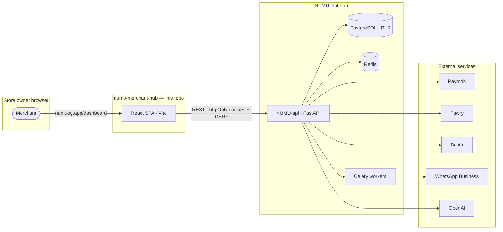
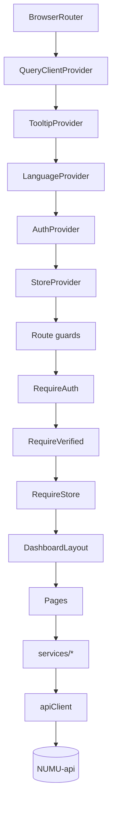
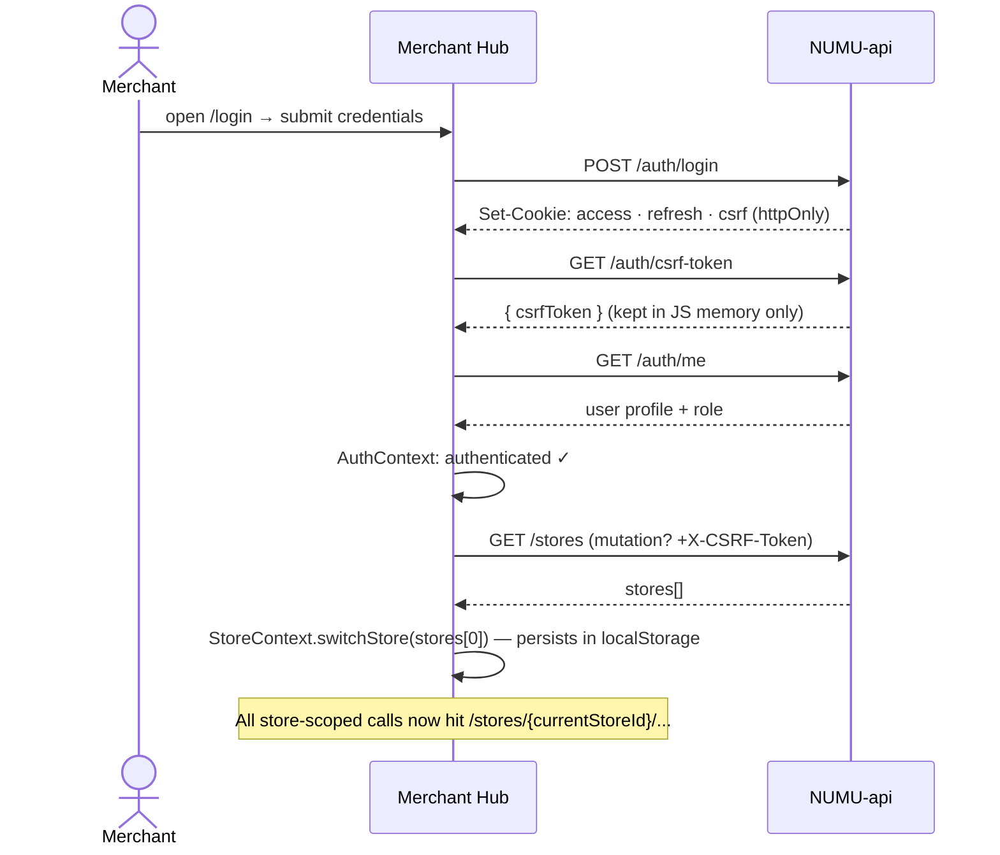

# NUMU Merchant Hub

The **merchant dashboard** for the NUMU e-commerce platform. Store owners sign in here to manage products, orders, customers, analytics, theme customization, and the omnichannel inbox (WhatsApp · Instagram · Messenger).

Equivalent to the Shopify admin panel — purpose-built for the Egyptian and MENA market.

---

## Table of contents

- [System context](#system-context)
- [Tech stack](#tech-stack)
- [Application architecture](#application-architecture)
- [Auth flow](#auth-flow)
- [Project structure](#project-structure)
- [Getting started](#getting-started)
- [Environment variables](#environment-variables)
- [Routes](#routes)
- [Conventions](#conventions)

---

## System context



---

## Tech stack

| Layer | Choice |
|-------|--------|
| Framework | React 18 + TypeScript 5.8 |
| Build | Vite (SWC) |
| Styling | Tailwind 3 · shadcn/ui · Radix primitives |
| State (server) | TanStack React Query v5 |
| State (client) | React Context (Auth · Store · Language) |
| Routing | react-router-dom 6 |
| Forms | React Hook Form + Zod |
| i18n | i18next (English + Egyptian Arabic, ~267 keys each) |
| Charts | Recharts |
| Icons | Lucide React |
| Drag & drop | @dnd-kit |
| Realtime | WebSocket (omnichannel inbox) |
| Package manager | npm |

---

## Application architecture

Three composable layers: routing → providers → API client.



The `apiClient` is a thin `fetch` wrapper that:

- attaches `credentials: "include"` on every request (httpOnly cookies)
- pulls the CSRF token from in-memory storage and sends `X-CSRF-Token` on mutations
- on `403 CSRF` failure → refreshes token, retries once
- on `401` → redirects to `/login`
- unwraps the `{ data: T }` envelope returned by the API

---

## Auth flow



---

## Project structure

```text
numo-merchant-hub/
├── public/                   # Static assets (NUMU brand favicons + logo)
├── src/
│   ├── components/
│   │   ├── layout/           # Sidebar, Header, DashboardLayout
│   │   └── ui/               # shadcn/ui primitives (50+ components)
│   ├── contexts/             # AuthContext · StoreContext · LanguageContext
│   ├── hooks/                # Custom hooks (useTheme, useDashboardKpis, …)
│   ├── i18n/                 # en.ts · ar.ts (Egyptian dialect)
│   ├── lib/                  # apiClient · csrf · utils
│   ├── pages/                # Route pages (Dashboard, Products, Orders, …)
│   ├── services/             # Per-domain API service modules
│   └── types/                # TypeScript types + generated API types
├── index.html                # NUMU-branded splash screen
├── vite.config.ts            # Vite + CSP + chunk strategy
└── tailwind.config.ts
```

---

## Getting started

```bash
# 1. Install dependencies
npm install

# 2. Configure environment
cp .env.example .env

# 3. Start the dev server (port 8080 — auto-killed if held)
npm run dev

# 4. Build for production
npm run build

# 5. Tests + lint + types
npm run test
npm run lint
npx tsc --noEmit
```

Helpful scripts:

```bash
npm run generate:types    # regenerate OpenAPI client types from local NUMU-api
npm run preview           # preview production build
```

---

## Environment variables

| Variable | Description |
|----------|-------------|
| `VITE_API_URL` | NUMU-api base URL (e.g. `http://localhost:8000/api/v1`) |
| `VITE_GOOGLE_CLIENT_ID` | Google OAuth client ID for one-tap sign-in |
| `VITE_META_APP_ID` | Meta (Facebook / Instagram) App ID |
| `VITE_META_LOGIN_CONFIG_ID` | Meta Login Config ID for channel linking |
| `VITE_META_OAUTH_REDIRECT` | OAuth redirect URI |
| `VITE_WS_URL` | WebSocket URL for the realtime inbox |
| `VITE_SENTRY_DSN` | Sentry DSN (optional) |

---

## Routes

| Route | Page | Notes |
|-------|------|-------|
| `/login` | Login | Login + register toggle |
| `/verify-email` | VerifyEmail | 6-digit OTP email verification |
| `/create-store` | CreateStore | Onboarding — first store |
| `/` | Dashboard | KPIs · revenue chart · top products · recent orders |
| `/products` | Products | Product CRUD with image upload + variants |
| `/orders` | Orders | List · detail · status workflow · bulk actions · CSV export |
| `/customers` | Customers | List with search + pagination |
| `/categories` | Categories | Category CRUD |
| `/analytics` | Analytics | Sales overview · charts · location breakdown |
| `/marketing` | Marketing | Coupon CRUD with product / category targeting |
| `/store` | StoreSettings | Profile · theme customizer · domain · shipping · nav editor |
| `/cod` | CODReconciliation | COD tracking *(mock data — pending API)* |
| `/social` | SocialImport | Import from Instagram / Facebook *(mock data)* |

---

## Conventions

- **Money in cents.** API returns integers; divide by 100 for display. Locale-aware formatting (`ar-EG` / `en-US`) per active language.
- **Product adapter.** `apiToProduct()` / `productToApiCreate()` convert between API and UI types — Arabic names live in `attributes` JSON.
- **Theme editor.** Full Shopify-style storefront customizer with live iframe preview via `postMessage` to the bazaar (port 3000).
- **i18n.** `i18next` with Egyptian-dialect Arabic. Switching language flips `document.dir` + `document.lang` for full RTL support.
- **Image upload.** Magic-bytes validation (JPEG / PNG / WebP), 5MB limit.
- **Skeletons.** Loading skeletons for Dashboard, Orders, Customers, Analytics — no white-flash.
- **Path alias.** `@/` → `./src/`.
